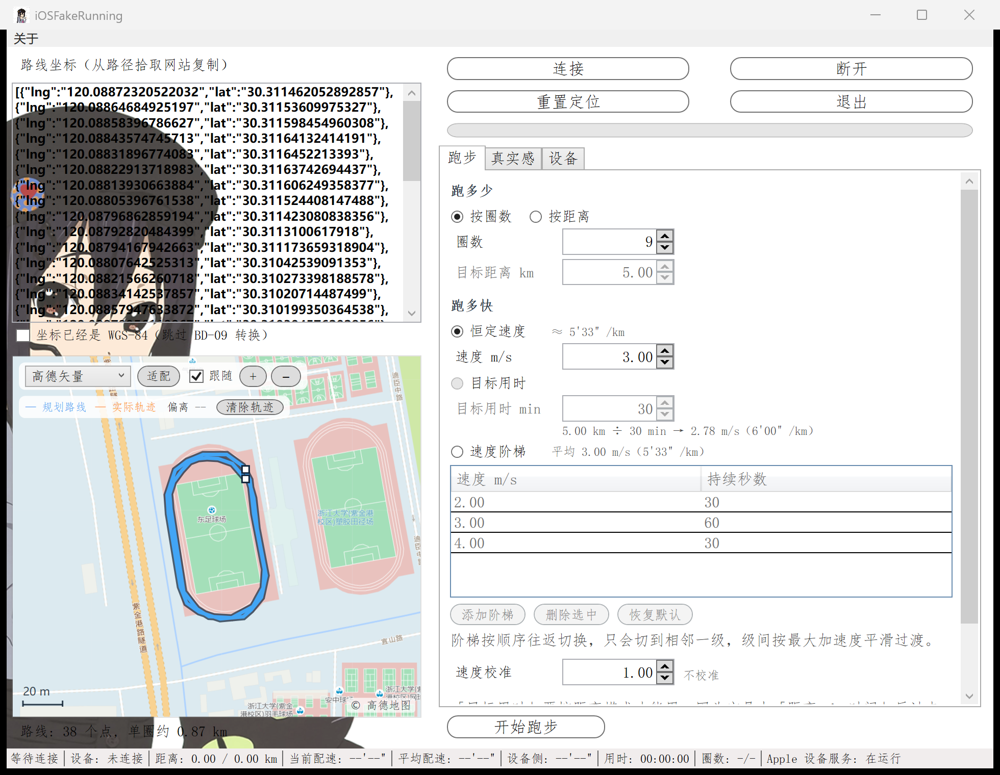

# iOSFakeRunning

iOS 免越狱虚拟跑步（Windows 端）——在真实地图上，让 iPhone 沿你指定的路线"跑"出一场配速可信的步。



> 基于 [Mythologyli/iOSFakeRun](https://github.com/Mythologyli/iOSFakeRun)（原作者 Mythologyli，LGPL-2.1）的二次开发，
> 按同协议继续开源，详见 [LICENSE](./LICENSE)。

## 功能

- **真实感模拟**：起跑/结束平滑加减速、N 级速度阶梯、速度微波动、路径漂移与 GPS 噪声（Ornstein-Uhlenbeck 相关过程，非白噪声）、非闭合路线自动往返衔接——手机上的跑步 App 看到的就是一场"真人跑"。
- **按圈数或按距离**：跑满自动停；也可"5 km ÷ 30 min"反推配速。速度校准（0.50–2.00）可对齐手机 App 的实测读数。
- **真实地图轨迹**：高德/Esri 四种底图（免 API key），规划路线（蓝）与实际轨迹（按圈六色）同图对照，红点实时跟随，偏离读数提示参数是否开猛。
- **连接稳**：自动管理 Store 版 Apple Devices 的用户态 usbmux 栈；写入失败自动重建连接并重试，跑步中失联不再直接报废一场跑。
- **界面自解释**：中文，三个页签，无隐藏配置。

## 使用方法

1. 安装 [.NET 6.0 Desktop Runtime](https://dotnet.microsoft.com/en-us/download/dotnet/6.0)。
2. 获取开发者镜像（本仓库不附带）：从 [Mythologyli/DeveloperDiskImage](https://github.com/Mythologyli/DeveloperDiskImage) 下载对应 iOS 版本的 `DeveloperDiskImage.dmg` 与 `.signature`，放入程序目录下 `DeveloperDiskImage/<版本号>/`。iOS 16 需在 设置 > 隐私与安全性 打开开发者模式。
3. 从源码运行或构建发布版：

   ```bash
   dotnet run --project iOSFakeRun            # 直接运行
   dotnet publish iOSFakeRun/iOSFakeRun.csproj -c Release -o dist   # 生成免安装发布目录
   ```

4. 在 [路径拾取网站](https://fakerun.myth.cx) 点击地图构造路线，复制坐标 JSON 粘贴进程序左栏。
5. 数据线连接 iPhone 并解锁，点「连接」，选好跑量后点「开始跑步」。
6. 跑完点「重置定位」，否则手机在重启前会停留在最后一次模拟的位置。

## 已知边界

- 协议只能模拟经纬度：**高程、心率、步数无法伪造**（HealthKit 步数与定位距离会互相矛盾，这是架构边界）。
- 自带镜像方案最高支持 iOS 16.7；iOS 17+ 需要另一套隧道机制，未支持。
- 高德底图为其未公开接口，存在被限流或变更的可能；Esri 系列为公开服务。地图缓存在 `%LOCALAPPDATA%\iOSFakeRun\MapCache`（上限 192 MB）。

## 免责声明

本工具仅供学习与研究使用。原作者为学习 .NET 而开发此软件，二次开发者在其基础上修改。
两者均不对软件的用途做任何说明或暗示，对使用本软件造成的任何后果概不负责。
请遵守当地法律法规，勿将本工具用于任何非法用途。

## 致谢

+ 原作者 [Mythologyli](https://github.com/Mythologyli/iOSFakeRun)（Myth）
+ [libimobiledevice](https://github.com/libimobiledevice/libimobiledevice)
+ [imobiledevice-net](https://github.com/libimobiledevice-win32/imobiledevice-net)
+ [Json.NET](https://www.newtonsoft.com/json)
+ [Extended WPF Toolkit™](https://github.com/xceedsoftware/wpftoolkit)
